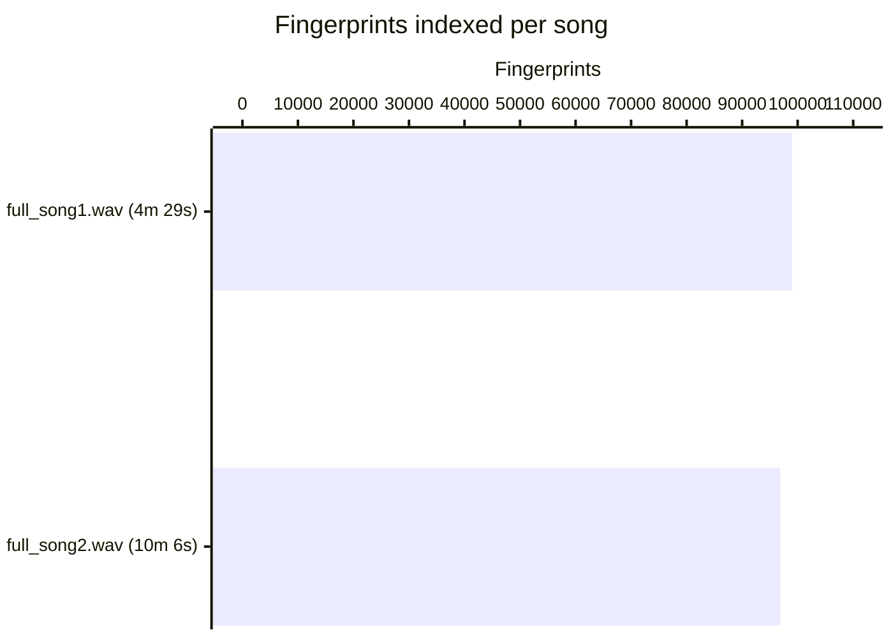
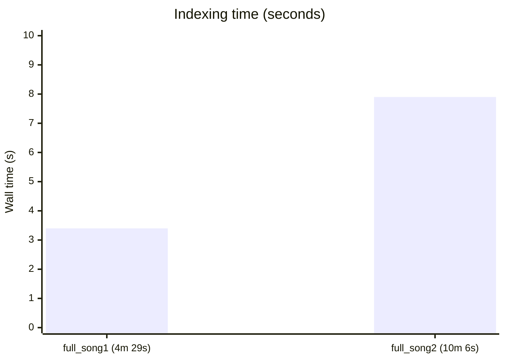
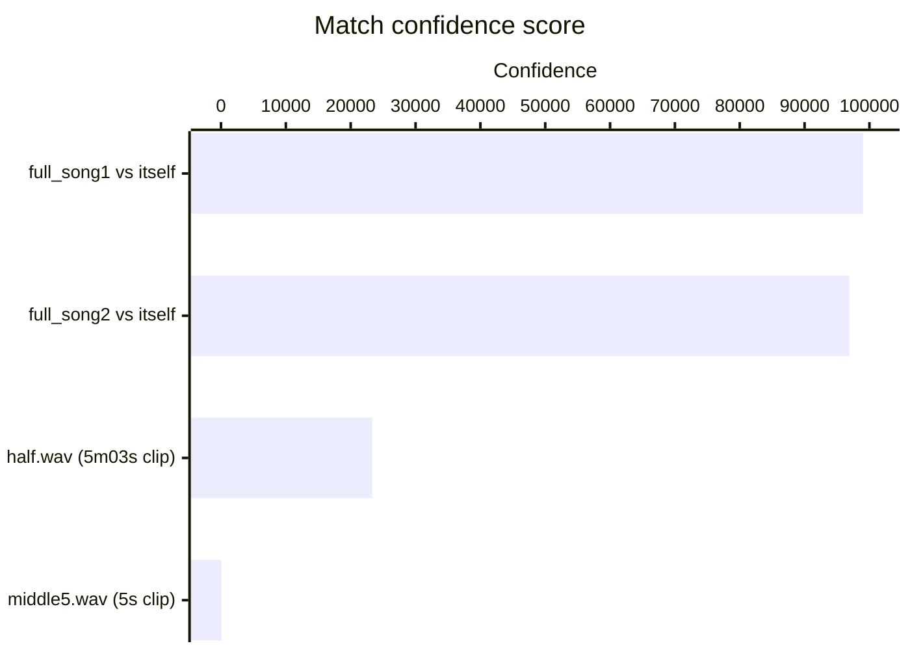
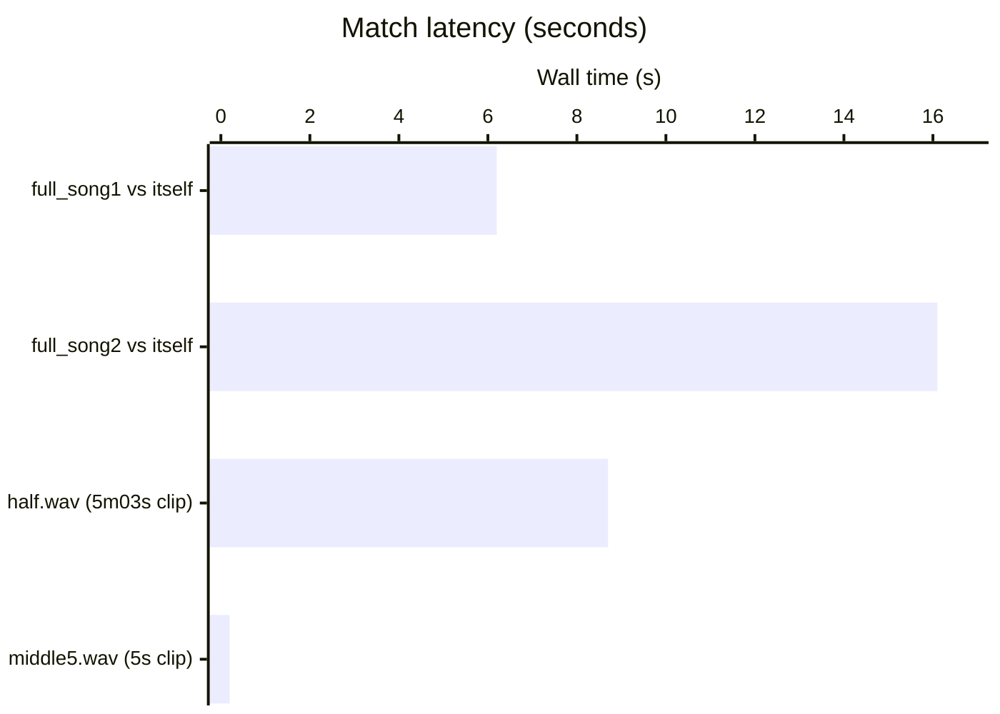

# waveiden

Audio fingerprinting library and CLI — identify songs from short audio clips.

## What it does

waveiden builds a compact acoustic fingerprint database from full-length audio files, then matches query clips against it in milliseconds. The approach is the same one powering services like Shazam:

1. Load audio and compute a short-time Fourier transform (spectrogram)
2. Detect spectral peaks and pair them into hashed landmarks
3. Store `(hash, time_offset, song_name)` triples in a database
4. At query time, look up hashes and vote on the song with the most time-consistent hits

A 30-second clip is enough for a reliable match against a database of thousands of songs. The library works against noisy or pitch-shifted recordings because the fingerprints are based on relative peak relationships rather than raw waveform content.

## Architecture

```
include/waveiden/
  types.hpp               Common value types (Peak, Fingerprint, MatchResult, AudioBuffer)
  dsp.hpp                 DSP namespace: FFT, Hann window, spectrogram, peak detection
  audio_reader.hpp        IAudioReader interface + WavReader (libsndfile)
  database.hpp            IDatabase interface + SQLiteDatabase implementation
  fingerprint_engine.hpp  High-level engine that wires the pipeline together
  waveiden.hpp            Umbrella include

grpc/
  proto/waveiden.proto    Service definition
  src/waveiden_service.*  gRPC service implementation (optional, see below)

examples/cli.cpp          Command-line tool built on top of the library
```

The library is structured around two abstract interfaces:

- **`IDatabase`** — defines `connect`, `disconnect`, `indexSong`, `match`, `listSongs`, `removeSong`, and `clear`. Swap in any storage backend by subclassing it.
- **`IAudioReader`** — defines `read(path)` and `readFromMemory(data, size)`. Swap in any audio format or source.

The `FingerprintEngine` class depends only on these interfaces, so it is fully testable and decoupled from I/O.

## Dependencies

| Dependency | Required | Notes |
|---|---|---|
| C++17 compiler | yes | GCC 12+ or Clang 14+ |
| CMake ≥ 3.20 | yes | |
| libsndfile | yes | WAV / FLAC / OGG decoding |
| SQLite 3 | bundled | Fetched as amalgamation via CMake FetchContent — no system package needed |
| gRPC C++ | optional | Only needed with `WAVEIDEN_ENABLE_GRPC=ON` |

Install libsndfile on Fedora/RHEL:
```bash
sudo dnf install libsndfile-devel
```

On Debian/Ubuntu:
```bash
sudo apt install libsndfile1-dev
```

## Building

```bash
# Build library + CLI
make build

# Or with explicit CMake
cmake -S . -B build -DCMAKE_BUILD_TYPE=Release
cmake --build build --parallel

# With gRPC extension (requires gRPC C++ installed on the system)
make grpc
```

The build produces:
- `build/libwaveiden.a` — static library
- `build/waveiden` — animated terminal UI and command-line tool

## Installation

```bash
# Installs headers to /usr/local/include/waveiden/
# and libwaveiden.a to /usr/local/lib/
sudo make install

# Or to a custom prefix
cmake --install build --prefix ~/.local
```

After installation, link against the library:
```cmake
find_package(waveiden REQUIRED)
target_link_libraries(my_app PRIVATE waveiden::waveiden)
```

Or with plain compiler flags:
```bash
g++ -std=c++17 main.cpp -lwaveiden -lsndfile -o app
```

## CLI usage

```
waveiden [mode] [args...]

  index  <db_path> <song.wav> [song2.wav ...]   Index one or more songs
  match  <db_path> <query.wav>                   Match a clip against the database
  list   <db_path>                               List all indexed songs
  remove <db_path> <name>                        Remove a song by name
  clear  <db_path>                               Wipe the entire database
  tui    <db_path>                               Open the animated signal console
```

Run `waveiden` with no arguments to open the animated TUI.

```bash
# Index a music library
./build/waveiden index library.db song1.wav song2.wav song3.wav

# Identify a recording or clip
./build/waveiden match library.db unknown_clip.wav
# MATCH: song2.wav  confidence=8400  offset=42.3s

# See what is in the database
./build/waveiden list library.db

# Remove a single entry
./build/waveiden remove library.db song1.wav

# Wipe everything
./build/waveiden clear library.db
```

### Animated terminal UI

Launch the signal console with:

```bash
./build/waveiden
```

The bare `waveiden` command opens the TUI against `fingerprint.db`. To open a
different database, use `waveiden tui library.db`.

It uses a pixel-art receiver, animated spectrum and radar display, and works
entirely by keyboard. `1` opens the signal deck, `2` the library, `I` indexes
an audio file, `M` identifies a clip, `D` removes the selected library entry,
and `Q` exits. The UI needs a terminal of at least 76×28 characters.

### Makefile shortcuts

```bash
make index  DB=library.db FILES="song1.wav song2.wav"
make match  DB=library.db QUERY=clip.wav
make list   DB=library.db
make remove DB=library.db NAME=song1.wav
make clear  DB=library.db
make test                                  # smoke test against sample WAVs
```

## Using as a library

```cpp
#include <waveiden/waveiden.hpp>

int main() {
    waveiden::SQLiteDatabase db;
    db.connect("library.db");

    waveiden::FingerprintEngine engine;

    // Index songs
    engine.indexFile("song1.wav", db);
    engine.indexFile("song2.wav", db);

    // Match a clip
    waveiden::MatchResult result = engine.matchFile("clip.wav", db);

    if (result.found) {
        std::cout << result.songName    << "\n";
        std::cout << result.confidence  << " matching fingerprints\n";
        std::cout << result.timeOffset  << "s into the song\n";
    }
}
```

### Custom database backend

```cpp
class MyDatabase : public waveiden::IDatabase {
public:
    void connect(const std::string& uri) override { /* ... */ }
    void disconnect() override { /* ... */ }
    void indexSong(const std::string& name,
                   const std::vector<waveiden::Fingerprint>& prints) override { /* ... */ }
    waveiden::MatchResult match(const std::vector<waveiden::Fingerprint>& query) const override { /* ... */ }
    std::vector<std::string> listSongs() const override { /* ... */ }
    void removeSong(const std::string& name) override { /* ... */ }
    void clear() override { /* ... */ }
    bool isEmpty() const override { /* ... */ }
};
```

### Custom audio reader

```cpp
class MyReader : public waveiden::IAudioReader {
public:
    waveiden::AudioBuffer read(const std::string& path) const override { /* ... */ }
    waveiden::AudioBuffer readFromMemory(const uint8_t* data, size_t size) const override { /* ... */ }
};

waveiden::FingerprintEngine engine(
    waveiden::FingerprintConfig{},
    std::make_unique<MyReader>());
```

## gRPC service

When built with `-DWAVEIDEN_ENABLE_GRPC=ON`, the `waveiden_grpc` static library exposes a gRPC service defined in `grpc/proto/waveiden.proto`. Two example binaries are also built: `waveiden_grpc_server` and `waveiden_grpc_client`.

```protobuf
service WaveidenService {
    rpc IndexSong     (IndexSongRequest)     returns (IndexSongResponse);
    rpc MatchSong     (MatchSongRequest)     returns (MatchSongResponse);
    rpc ListSongs     (ListSongsRequest)     returns (ListSongsResponse);
    rpc RemoveSong    (RemoveSongRequest)    returns (RemoveSongResponse);
    rpc ClearDatabase (ClearDatabaseRequest) returns (ClearDatabaseResponse);
}
```

### Running the example server and client

```bash
# Build with gRPC enabled
make grpc

# Terminal 1 — start the server
make server DB=library.db
# or directly:
./build/waveiden_grpc_server --listen 0.0.0.0:50051 --db library.db

# Terminal 2 — use the client
./build/waveiden_grpc_client index "Rap God" song.wav "Lose Yourself" song2.wav
./build/waveiden_grpc_client match clip.wav
./build/waveiden_grpc_client list
./build/waveiden_grpc_client remove "Rap God"
./build/waveiden_grpc_client clear

# Point at a remote server
./build/waveiden_grpc_client --server 192.168.1.10:50051 match clip.wav
```

Makefile shortcuts for the client:
```bash
make rpc-index  FILES="MySong song.wav MySong2 song2.wav"
make rpc-match  QUERY=clip.wav
make rpc-list
make rpc-remove NAME=MySong
make rpc-clear
# Override the server address
make rpc-match  SERVER_ADDR=192.168.1.10:50051 QUERY=clip.wav
```

### Embedding the server in your application

```cpp
#include <waveiden/waveiden.hpp>
#include <waveiden_service.hpp>

int main() {
    waveiden::SQLiteDatabase db;
    db.connect("library.db");

    // Blocks until the server is shut down
    waveiden::grpc_ext::runServer("0.0.0.0:50051", db);
}
```

Link against `waveiden_grpc` (which pulls in `waveiden`, `grpc++`, and `protobuf` transitively):
```cmake
target_link_libraries(my_server PRIVATE waveiden_grpc)
```

### Using the client class directly

```cpp
#include <waveiden.grpc.pb.h>
#include <grpcpp/grpcpp.h>

auto channel = grpc::CreateChannel("localhost:50051",
                   grpc::InsecureChannelCredentials());
auto stub = waveiden::WaveidenService::NewStub(channel);

// Match a clip
waveiden::MatchSongRequest req;
req.set_audio_data(/* raw WAV bytes */);

waveiden::MatchSongResponse resp;
grpc::ClientContext ctx;
stub->MatchSong(&ctx, req, &resp);

if (resp.found())
    std::cout << resp.song_name() << " @ " << resp.time_offset() << "s\n";
```

## Benchmark results

Tests run against two full songs and two query clips on a single CPU core.

### Fingerprints generated per song



### Indexing time vs. audio duration



### Match confidence by query clip

Confidence = number of time-coherent hash collisions between the query and the matched song.
A full song queried against itself is the theoretical maximum.



### Match latency by query clip



> `middle5.wav` is a 5-second clip taken from the middle of `full_song2.wav` (offset ≈ 30s).
> Its low confidence (81) relative to its correct match illustrates that shorter clips produce
> fewer fingerprints and therefore lower absolute scores — but the match is still unambiguous
> since no other song comes close.

## Tuning fingerprint quality

`FingerprintConfig` controls the DSP pipeline:

```cpp
waveiden::FingerprintConfig cfg;
cfg.frameSize       = 2048;   // FFT window size in samples
cfg.hopSize         = 512;    // Hop between frames in samples
cfg.peakPct         = 98.5;   // Magnitude percentile threshold for peaks (higher = fewer, stronger peaks)
cfg.maxPeaks        = 10000;  // Cap on peaks kept per song
cfg.maxPairsPerPeak = 10;     // Pairs formed per anchor peak
cfg.maxDt           = 100;    // Maximum time-frame distance between paired peaks

waveiden::FingerprintEngine engine(cfg);
```

Raise `peakPct` or lower `maxPairsPerPeak` to reduce database size. Lower `peakPct` or raise `maxPairsPerPeak` to improve match recall on noisy clips.
